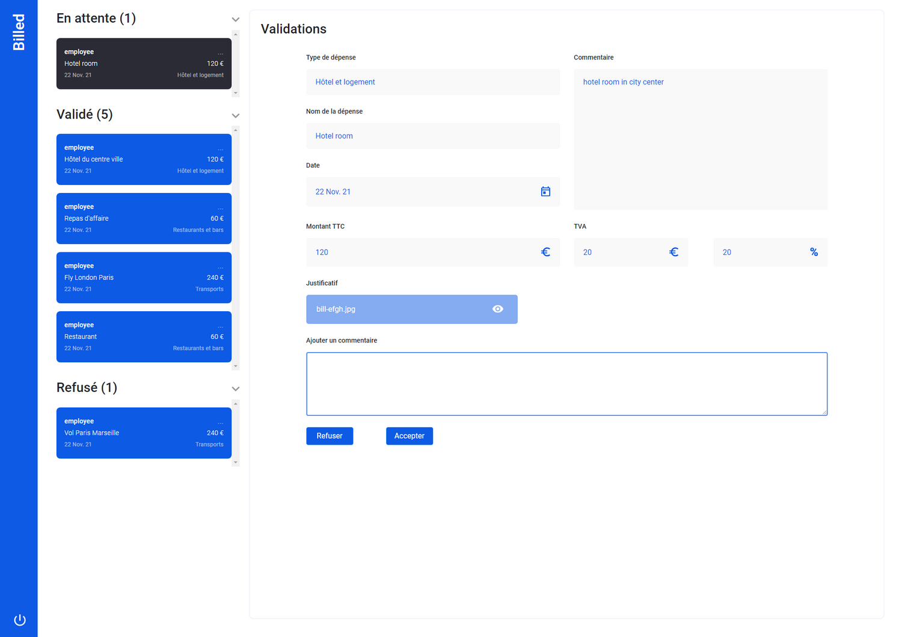

## Débuggez et testez un SaaS RH - Billed
### P9 - OpenClassrooms "Développeur Concepteur Logiciel"

#### Contexte du projet

Vous êtes développeur front-end chez Billed, une entreprise qui produit des solutions Saas destinées aux équipes de ressources humaines.

Malheureusement pour Billed, Garance, une collègue de la feature team “note de frais” a quitté l’entreprise avant d’avoir terminé l’application. Dans deux semaines, l’équipe doit montrer la solution qui fonctionne à l’ensemble de l’entreprise. Matthieu, Lead Developer de la feature team a demandé à être aidé pour tenir les délais et vous avez appris hier lors de la réunion d’équipe que c’est vous qui avez été désigné !

À votre arrivée ce matin, vous avez reçu un e-mail de la part de Matthieu, qui donne plus de détails sur ce qui est attendu de vous.

<details><summary><b>Email: Urgent - Informations sur la mission de renfort au sein de la feature team “note de frais”</b></summary>

```
De : Matthieu
À : Moi
```

Bonjour,

Tout d’abord, merci de nous prêter main-forte cette semaine pour la mise en place de tests sur la fonctionnalité “note de frais”.

Cette fonctionnalité est très attendue sur le marché et le top management a mis la priorité dessus. L’objectif est de la lancer officiellement auprès de nos clients d’ici 2 semaines. Les délais sont donc très serrés. La feature team a beaucoup travaillé ces dernières semaines, mais le départ de Garance n’arrange pas les choses et nous avons besoin de ton aide pour la dernière ligne droite.

**Présentation de la fonctionnalité**

Pour comprendre son utilité et savoir comment elle marche, lis d’abord la [description de la fonctionnalité](./src/assets/Description%20des%20fonctionnalités.pdf). \
Comme tu peux le constater, il y a deux parcours utilisateurs : un administrateur RH et un employé. 

**État d’avancement du projet**

L’essentiel a déjà été développé, je te rassure :

✅ Le back-end des deux parcours est prêt en version alpha. \
🚧 Côté front-end : \
↳ Parcours administrateur : il a été testé par Garance, il faut désormais le débugger. \
↳ Parcours employé : il faut entièrement le tester et le débugger.

Garance avait utilisé Chrome Debugger, il faudra continuer avec cet outil.

**Comment accéder à la fonctionnalité ?**

Tu devras installer le back-end [disponible sur ce repo](https://github.com/Alex-Pqn/Billed-backend-ocr_dcl) ainsi que le frontend. Suis bien les instructions des deux README pour comprendre comment faire fonctionner tout ça.

**Tes missions**

Tout ce que j’attends de toi pour fiabiliser et améliorer le parcours employé est décrit dans [ce document](./src/assets/Description%20pratique%20des%20besoins.pdf). Il correspond à la description pratique des besoins pour la mise en place de la fonctionnalité. Il faut que tu le lises très attentivement. 

Tu y trouveras notamment le [rapport avec les bugs identifiés](https://alex-pqn.notion.site/50055c41e1934888ba341b1d4d7194b5?v=acedf821fede45009080691b585b5f61&pvs=4) (Kanban Notion) ainsi qu’un [exemple de plan de tests End-to-End](./src/assets/Exemple%20plan%20de%20tests%20E2E.pdf). 


Voilà, bon courage pour résoudre ces bugs et mettre en place les tests manquants ! On compte sur toi.


Matthieu \
*Lead Developer @Billed*
</details>

Ça y est, vous avez toutes les informations pour démarrer la correction de cette application. C’est parti !

#### Objectifs réalisés
- [Description des fonctionnalités](./src/assets/Description%20des%20fonctionnalités.pdf) respectée
- Ajout des tests unitaires et d’intégration pour les fichiers Bills et NewBill. [Couverture globale](./src/assets/Rapport%20couverture.PNG) des containers demandés de 80% minimum (tests unitaires et tests d’intégration)
  - Mock de l’API utilisé
  - Erreurs 404 et 500 testées
- Fix des bugs identifiés dans le [Kanban](https://alex-pqn.notion.site/50055c41e1934888ba341b1d4d7194b5?v=acedf821fede45009080691b585b5f61&pvs=4) fourni
- Rédaction du [plan de test End-to-End (E2E)](./src/assets/Plan%20de%20tests%20E2E.pdf) sur le parcours employé
- Parcours administrateur : débuggé
- Parcours employé : testé et débuggé

## Prerequisites

- You will need to have Node and `npm` installed locally on your machine.

| Node Version | Supported          |
| ------------ | ------------------ |
| 18.17.1      | :white_check_mark: |

> [!WARNING]
> The [backend](https://github.com/Alex-Pqn/Billed-backend-ocr_dcl) must also be installed in order to launch this project.

## Start App

### Install
```
npm install
```

### Live-Server
Install live-server to launch a local server
```
npm install -g live-server
```

### Compiles and hot-reloads for development
Runs the app in the development mode. \
Open [http://127.0.0.1:8080](http://127.0.0.1:8080) to view it in your browser.
```
live-server
```


### Running Jest tests
```
npm run test
```

> [!NOTE]
> The test coverage is available at `http://127.0.0.1:8080/coverage/lcov-report/index.html`

### How do I run a single test ?
Install jest-cli
```
npm i -g jest-cli
```
Then launch a test with
```
jest src/__tests__/your_test_file.js
```

## Accounts / Login

| Email                      | Password          | Is Admin |
| -------------------------- | ----------------- | -------- |
| admin@test.tld             | admin             | Yes      |
| employee@test.tld          | employee          | No       |

### Preview


<br/>
<br/>
<br/>

